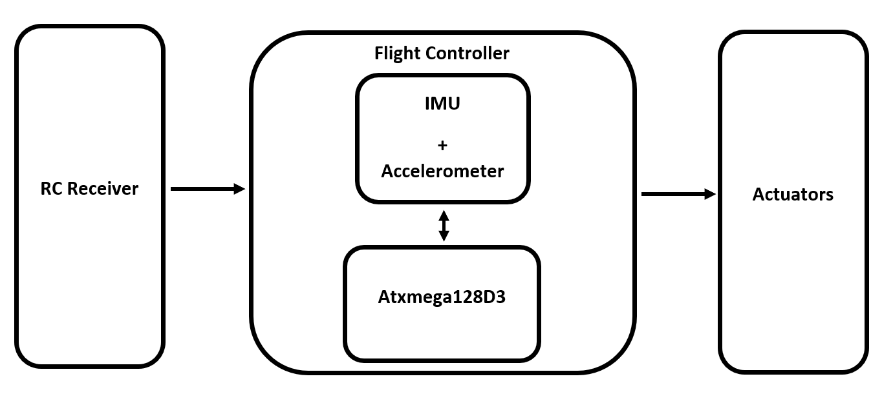

Quadcopter drone main firmware
==========

# Summary
This firmware reads the RC reciver signals and and control the quadcopter propellers accordign to that. it use PID controller to stabilize the system

# Introduction

According to the figure the flight controller reads the RC receive PWM pulses to control yaw, pitch, roll and throttle. Apart from that the flight controller reads IMU data to stabilize the drone. This drone use PID controller to control algorithm to stable.
